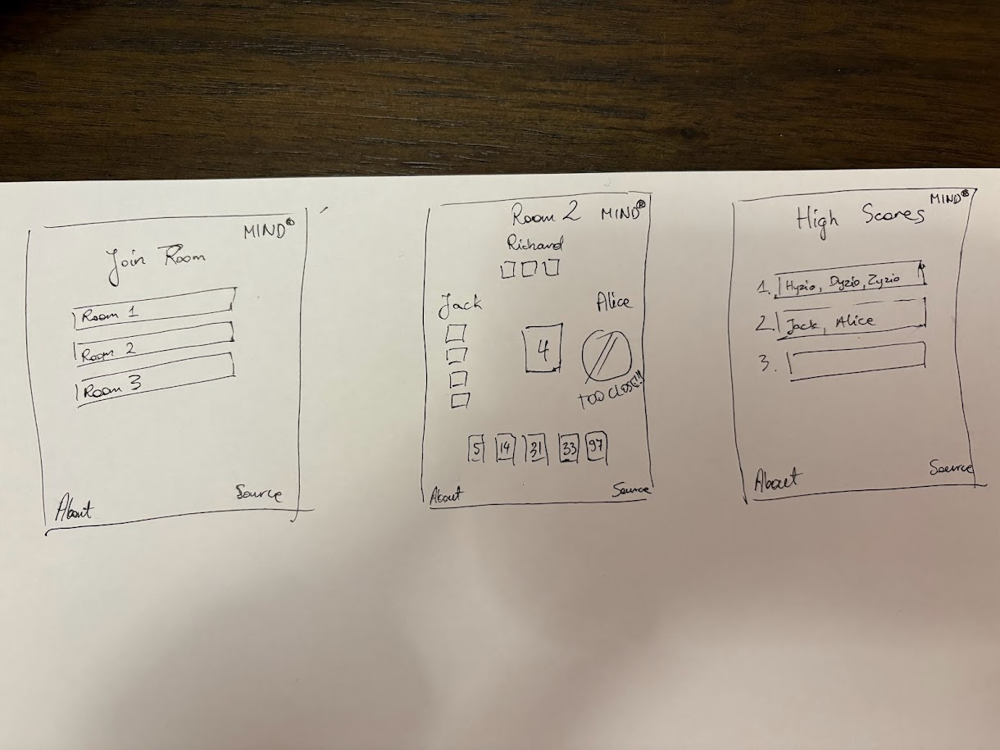

# ONLINE MIND

[My Notes](notes.md)

My startup will be a website that provides an online version of the game Mind. Mind is a cooperative card game where players draw a few cards from a deck that contains the numbers from 1-100 and try to place their cards on a pile in increasing order without any kind of communication.

> [!NOTE]
> This is a template for your startup application. You must modify this `README.md` file for each phase of your development. You only need to fill in the section for each deliverable when that deliverable is submitted in Canvas. Without completing the section for a deliverable, the TA will not know what to look for when grading your submission. Feel free to add additional information to each deliverable description, but make sure you at least have the list of rubric items and a description of what you did for each item.

> [!NOTE]
> If you are not familiar with Markdown then you should review the [documentation](https://docs.github.com/en/get-started/writing-on-github/getting-started-with-writing-and-formatting-on-github/basic-writing-and-formatting-syntax) before continuing.

## 🚀 Specification Deliverable

> [!NOTE]
> Fill in this sections as the submission artifact for this deliverable. You can refer to this [example](https://github.com/webprogramming260/startup-example/blob/main/README.md) for inspiration.

For this deliverable I did the following. I checked the box `[x]` and added a description for things I completed.

- [x] Proper use of Markdown
- [x] A concise and compelling elevator pitch
- [x] Description of key features
- [x] Description of how you will use each technology
- [x] One or more rough sketches of your application. Images must be embedded in this file using Markdown image references.

### Elevator pitch

How would you like to try reading someone's mind over the internet? Mind challenges you to read your teammates' minds and win the game. You can check out the current high scores and try to beat them. But no cheating!

### Design

### Key features

- Main page with available rooms and a create room button
- Gameplay page
- High scores page
- About page

### Technologies

I am going to use the required technologies in the following ways.

- **HTML** - The structure of the website
- **CSS** - Make the website look good, especially the gameplay page. Maybe do a little bit of simple animation
- **React** - Handle gameplay UI
- **Service** - Pick random background pictures for gameplay page
- **DB/Login** - Login to create rooms
- **WebSocket** - Handle multiple people playing the same game simultaneously

## 🚀 AWS deliverable

For this deliverable I did the following. I checked the box `[x]` and added a description for things I completed.

- [x] **Server deployed and accessible with custom domain name** - [My server link](https://yourdomainnamehere.click).

## 🚀 HTML deliverable

For this deliverable I did the following. I checked the box `[x]` and added a description for things I completed.

- [x] **HTML pages** - I created 5 html pages for my application.
- [x] **Proper HTML element usage** - I used typical html elements.
- [x] **Links** - I included links between the pages of my website.
- [x] **Text** - The application's textual content is there.
- [x] **3rd party API placeholder** - The image in index.html is a placeholder for the background generating API I intend to use.
- [x] **Images** - I included an image or two.
- [x] **Login placeholder** - I added a textbox and submit button on the login page.
- [x] **DB data placeholder** - I have a table as a placeholder for DB data in scores.
- [x] **WebSocket placeholder** - I have placeholders for gameplay elements on the play page.

## 🚀 CSS deliverable

For this deliverable I did the following. I checked the box `[x]` and added a description for things I completed.

- [x] **Visually appealing colors and layout. No overflowing elements.** - I did not complete this part of the deliverable.
- [x] **Use of a CSS framework** - I did not complete this part of the deliverable.
- [x] **All visual elements styled using CSS** - I did not complete this part of the deliverable.
- [x] **Responsive to window resizing using flexbox and/or grid display** - I did not complete this part of the deliverable.
- [x] **Use of a imported font** - I did not complete this part of the deliverable.
- [x] **Use of different types of selectors including element, class, ID, and pseudo selectors** - I did not complete this part of the deliverable.

## 🚀 React part 1: Routing deliverable

For this deliverable I did the following. I checked the box `[x]` and added a description for things I completed.

- [ ] **Bundled using Vite** - I did not complete this part of the deliverable.
- [ ] **Components** - I did not complete this part of the deliverable.
- [ ] **Router** - I did not complete this part of the deliverable.

## 🚀 React part 2: Reactivity deliverable

For this deliverable I did the following. I checked the box `[x]` and added a description for things I completed.

- [ ] **All functionality implemented or mocked out** - I did not complete this part of the deliverable.
- [ ] **Hooks** - I did not complete this part of the deliverable.

## 🚀 Service deliverable

For this deliverable I did the following. I checked the box `[x]` and added a description for things I completed.

- [ ] **Node.js/Express HTTP service** - I did not complete this part of the deliverable.
- [ ] **Static middleware for frontend** - I did not complete this part of the deliverable.
- [ ] **Calls to third party endpoints** - I did not complete this part of the deliverable.
- [ ] **Backend service endpoints** - I did not complete this part of the deliverable.
- [ ] **Frontend calls service endpoints** - I did not complete this part of the deliverable.
- [ ] **Supports registration, login, logout, and restricted endpoint** - I did not complete this part of the deliverable.

## 🚀 DB deliverable

For this deliverable I did the following. I checked the box `[x]` and added a description for things I completed.

- [ ] **Stores data in MongoDB** - I did not complete this part of the deliverable.
- [ ] **Stores credentials in MongoDB** - I did not complete this part of the deliverable.

## 🚀 WebSocket deliverable

For this deliverable I did the following. I checked the box `[x]` and added a description for things I completed.

- [ ] **Backend listens for WebSocket connection** - I did not complete this part of the deliverable.
- [ ] **Frontend makes WebSocket connection** - I did not complete this part of the deliverable.
- [ ] **Data sent over WebSocket connection** - I did not complete this part of the deliverable.
- [ ] **WebSocket data displayed** - I did not complete this part of the deliverable.
- [ ] **Application is fully functional** - I did not complete this part of the deliverable.
